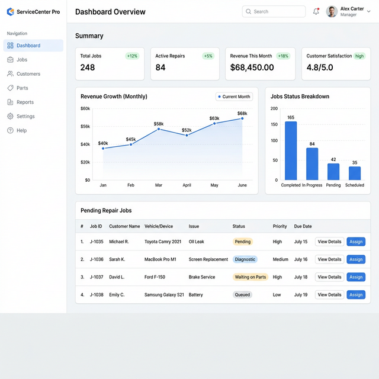
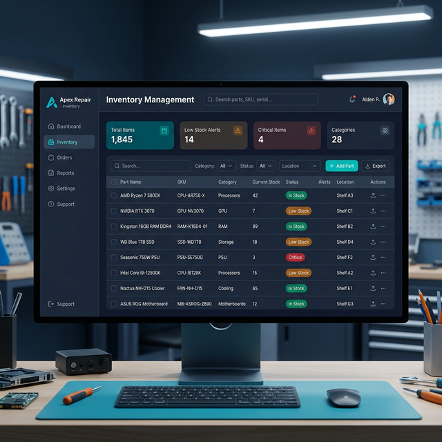
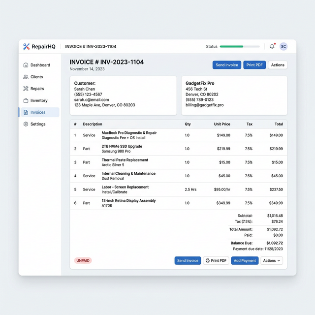

# 🛠️ Next-Gen Service Center Management Software

_Stop managing chaos. Start managing growth._

Are you still relying on paper job cards, scattered Excel sheets, and constant phone calls to run your repair business? Our all-in-one Service Center Management platform gives you complete control over your operations, from the moment a device enters your shop to final billing.

---

## 📸 See It In Action

### 1. The Executive Dashboard

Gain total visibility into your business. Track daily revenue, pending jobs, and technician workload across all your branches at a glance.

### 2. Airtight Inventory Control

Never worry about missing parts. Our system automatically updates stock levels when parts are used in a repair or sold directly.

### 3. Professional GST Invoicing

Generate beautiful, fully compliant GST invoices in seconds with automated multi-tax (CGST/SGST/IGST) calculations.

---

## ⚡ Core Features That Drive ROI

### 1. Smart Job Card Management

- Create digital job cards with pre-intake device photos and condition reports.
- Track real-time progress: _Received → Diagnosis → Under Repair → Ready_.
- Customers receive automated WhatsApp/SMS updates at every stage.

### 2. Zero-Leakage Inventory

- Track parts across multiple branches centrally.
- Receive low-stock alerts _before_ you run out of essential items.
- Full audit history ensures 100% accountability for every spare part.

### 3. Comprehensive Billing & Payments

- One-click conversion from Job Card to final Invoice.
- Support for advance payments, partial payments, and multiple payment modes (UPI, Cash, Card).
- Print professional, branded PDFs instantly.

### 4. Advanced Security & Trust

- **OTP-Based Delivery:** Ensure the device is only handed back to the rightful owner.
- **Secure Password Vault:** Log and protect customer device passwords.
- **Role-Based Access:** Give receptionists, technicians, and managers only the access they need.

---

## 📈 The Business Value

> [!TIP]
> **Why businesses switch to us:**
> A typical service center loses thousands of rupees monthly to unbilled parts, lost productivity, and manual invoicing errors. Our platform plugs these holes immediately.

| Feature Area         | Your Current Reality                       | With Our Software                                 |
| :------------------- | :----------------------------------------- | :------------------------------------------------ |
| **Customer Support** | "Hello sir, laptop kab milega?"            | Automated SMS limits incoming query calls by 80%. |
| **Billing**          | 10 minutes spent calculating GST manually. | < 2 minutes to generate a perfect PDF invoice.    |
| **Inventory**        | Manual end-of-day stock counting.          | Real-time, auto-deducting stock levels.           |
| **Multi-Branch**     | Driving between shops to check progress.   | Live cloud dashboard accessible from your phone.  |

---

**Ready to modernize your service center?**
Contact us today to schedule a personalized live demonstration.
